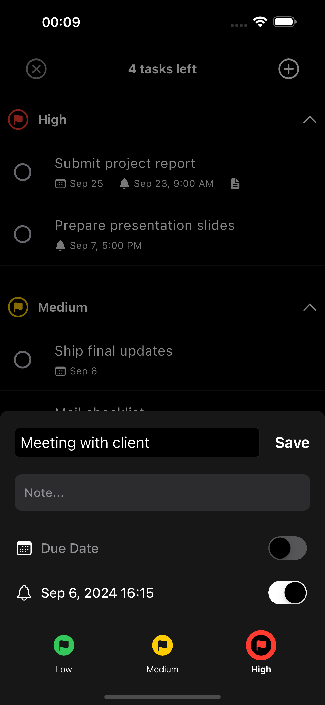
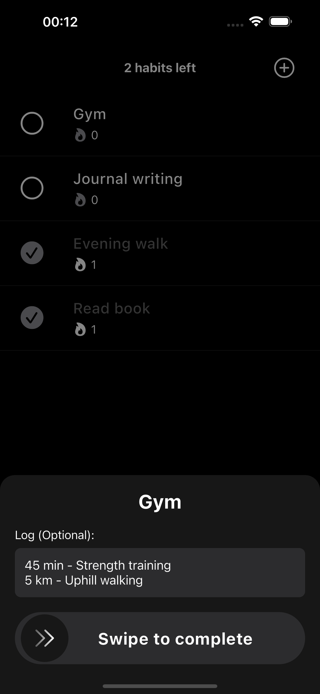

# karman

<p align="center">
  
</p>

<p align="center">
  A minimalist and intuitive productivity app for task management, habit tracking, and focus enhancement.
</p>

<p align="center">
  <a href="https://play.google.com/store/apps/details?id=com.surtecha.karman"></a>
</p>

<p align="center">
  <a href="https://github.com/surtecha/karman/releases"></a>
  <a href="https://github.com/surtecha/karman/blob/main/LICENSE"></a>
  <a href="https://discord.gg/AH7dAXfxkD"></a>
  
  
</p>

## Table of Contents

- [Features](#features)
- [Screenshots](#screenshots)
- [Getting Started](#getting-started)
- [Contributing](#contributing)
- [Contributors](#contributors)
- [Roadmap](#roadmap)
- [Community](#community)
- [Sponsorship](#sponsorship)
- [License](#license)
- [Acknowledgements](#acknowledgements)

## Features

- **Task Management**: Organize and prioritize tasks with a clean interface
- **Habit Tracking**: Build and maintain daily habits
- **Focus Timer**: Boost productivity with a built-in Pomodoro-style timer
- **Minimalism**: Distraction-free and intuitive design
- **Absoultely Free**: No paywalls, hidden charges, or in-app purchases
- **Privacy-Focused**: No data collection or tracking
- **Lightweight**: Minimal impact on device storage and performance

## Screenshots

| Task Management | &nbsp;&nbsp;&nbsp; | Habit Tracking | &nbsp;&nbsp;&nbsp; | Focus Timer |
|:---------------:|:---:|:--------------:|:---:|:-----------:|
|  | |  | |  |


## Getting Started

### Prerequisites

- Flutter SDK: [Installation Guide](https://flutter.dev/docs/get-started/install)
- Android Studio / VS Code
- Git

### Installation

1. Clone the repository:
   ```bash
     flutter pub get
   ```
2. Install dependencies:
  ```bash
    flutter pub get
  ```
3. Run the app:
  ```bash
    flutter run
  ```


## Contributing

We welcome contributions from the community! Please read our [Contributing Guidelines](CONTRIBUTING.md) before submitting any pull requests.

### Reporting Issues

Found a bug or have a feature request? Open an issue on our [Issues page](https://github.com/surtecha/karman/issues).

### Development Setup

1. Fork the repository
2. Create your feature branch (`git checkout -b feature/AmazingFeature`)
3. Commit your changes (`git commit -m 'Add some AmazingFeature'`)
4. Push to the branch (`git push origin feature/AmazingFeature`)
5. Open a Pull Request

## Contributors

### Founder & Lead Developer
<table>
  <tr>
    <td align="center"><a href="https://github.com/surtecha"><br /><sub><b>Suryateja Challa</b></sub></a></td>
  </tr>
</table>

### UI/UX Designer & Brand Strategist
<table>
  <tr>
    <td align="center"><a href="https://github.com/SkinnyFatBoy05"><br /><sub><b>Kishore Srinivasan</b></sub></a></td>
  </tr>
</table>

### Key Contributors & Beta Testers
We extend our heartfelt gratitude to the following individuals for their significant contributions in testing and providing valuable feedback:

<table>
  <tr>
    <td align="center"><a href="https://github.com/sathwik2809"><br /><sub><b>Sree Sathwik Challa</b></sub></a></td>
    <td align="center"><a href="https://github.com/silver-shadow"><br /><sub><b>Kusha Makapur</b></sub></a></td>
    <td align="center"><a href="https://github.com/pkv-woodstock"><br /><sub><b>Pavan Kumar</b></sub></a></td>
    <td align="center"><a href="https://github.com/tejasrajegowda"><br /><sub><b>Tejas Rajegowda</b></sub></a></td>
  </tr>
</table>

We also express our sincere appreciation to all our beta testers and users whose invaluable feedback has been instrumental in shaping and improving karman.

## Roadmap

- [ ] Additional ambient sounds for the focus timer
- [ ] Enhanced habit tracking badges
- [ ] Optimized Android notification icons
- [ ] iOS version

## Community

<p align="center">
  <a href="https://discord.gg/AH7dAXfxkD">
    
  </a>
</p>

Join our vibrant Discord community to become part of the karman family! By joining, you can:

- Connect directly with the development team
- Suggest new ideas and feature requests
- Report bugs and get quick support
- Interact with other karman users
- Stay updated on the latest developments
- Contribute to the project's growth

Your input is valuable to us, and we're excited to hear from you!

## Sponsorship

<p align="center">
  <a href="https://github.com/sponsors/surtecha">
    
  </a>
  <a href="https://www.buymeacoffee.com/surtecha">
    
  </a>
  <a href="https://paypal.me/surtecha">
    
  </a>
  <a href="https://github.com/surtecha/karman/blob/main/assets/phonepe_qr.png">
    
  </a>
</p>

karman is more than just another productivity app—it's a movement towards accessible, ad-free tools that empower everyone to achieve their goals. By becoming a sponsor, you're not just supporting an app; you're investing in a vision of digital well-being for all.

### Why Sponsor karman?

1. **Empower Universal Productivity**: Your support ensures karman remains free and accessible to everyone, from students to professionals, regardless of their financial situation.

2. **Foster Innovation**: As an open-source project, karman pushes the boundaries of what's possible in mobile productivity. Your sponsorship fuels continued innovation and improvement.

3. **Promote Digital Well-being**: By keeping karman ad-free and focused on user needs, you're supporting a healthier relationship with technology for thousands of users.

4. **Support Ethical Software Development**: Your contribution helps set an example for transparent, user-focused software in an age of data mining and privacy concerns.

5. **Join a Community**: Sponsors become part of the karman family, with opportunities to influence the app's direction and connect with like-minded individuals passionate about productivity.

6. **Make a Tangible Impact**: Every feature added, every bug fixed, and every new user reached is a direct result of your support. Watch your contribution make a real difference.

### How Your Sponsorship Helps

- Covers essential costs for app store fees, ensuring karman remains available on major platforms
- Allows for dedicated development time to implement new features and optimizations
- Enables participation in open-source events and conferences to spread the word about karman

### Be the Change

In a world where attention is constantly commodified, your sponsorship of karman stands as a beacon for what software can be—helpful, respectful, and empowering. 

Every contribution, no matter the size, moves us closer to a future where top-tier productivity tools are a right, not a privilege.

**Ready to make a difference?** [Become a sponsor today](https://github.com/sponsors/surtecha) and help shape the future of productivity for everyone.

## License

karman is licensed under the [GNU General Public License v3.0 (GPL-3.0)](LICENSE).

## Acknowledgements

- [Flutter](https://flutter.dev/) for the amazing framework
- [SQLite](https://sqlite.org/) for local storage
- The creators of the following ```pub.dev``` packages that made this project possible:
  - [flutter_slidable](https://pub.dev/packages/flutter_slidable)
  - [go_router](https://pub.dev/packages/go_router)
  - [flutter_local_notifications](https://pub.dev/packages/flutter_local_notifications)
  - [provider](https://pub.dev/packages/provider)
  - [slide_to_act](https://pub.dev/packages/slide_to_act)
  - [sleek_circular_slider](https://pub.dev/packages/sleek_circular_slider)
  - [audioplayers](https://pub.dev/packages/audioplayers)
  - [just_audio](https://pub.dev/packages/just_audio)
  - [table_calendar](https://pub.dev/packages/table_calendar)
  - [smooth_page_indicator](https://pub.dev/packages/smooth_page_indicator)
  - [lottie](https://pub.dev/packages/lottie)
  - [url_launcher](https://pub.dev/packages/url_launcher)
  - [flutter_native_splash](https://pub.dev/packages/flutter_native_splash)
  - And all other packages listed in our pubspec.yaml

---

<p align="center">
  Made with passion by <a href="https://github.com/surtecha">surtecha</a>
</p>
