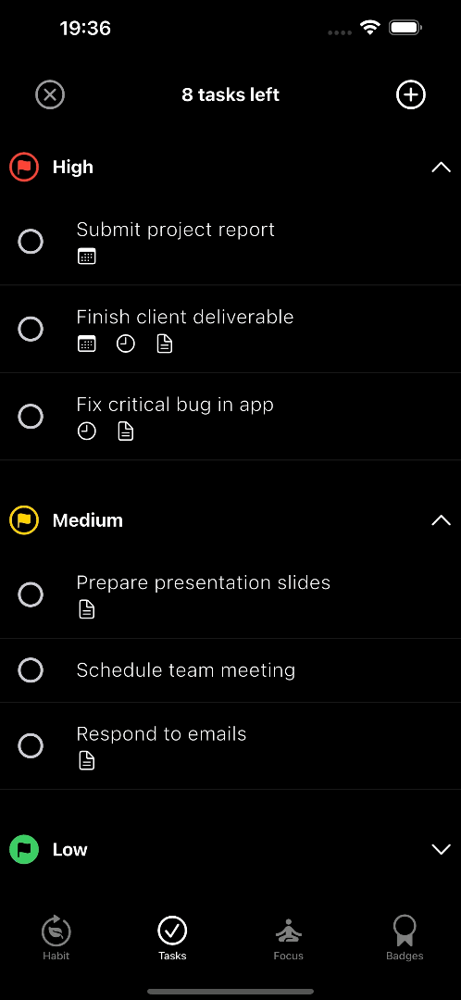
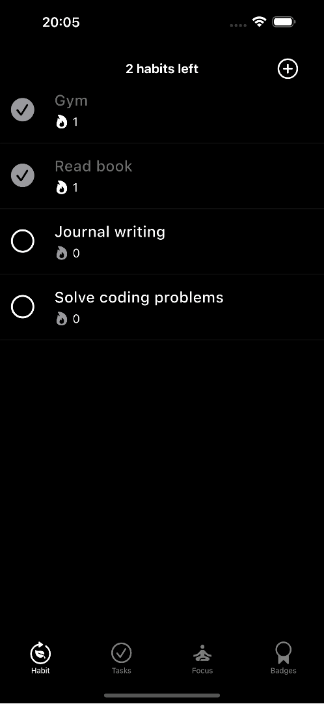

# karman

<p align="center">
  
</p>

<p align="center">
  <strong>karman</strong> is a minimalist and intuitive productivity app designed to help you manage tasks, track habits, and stay focused. Completely free and open-source, karman is perfect for individuals who value simplicity and efficiency.
</p>

<p align="center">
  <a href="https://github.com/surtecha/karman/releases">
    
  </a>
  <a href="https://github.com/surtecha/karman/issues">
    
  </a>
  <a href="https://github.com/surtecha/karman/blob/main/LICENSE">
    
  </a>
</p>

## Features

<table align="center">
  <tr>
    <td></td>
    <td style="width: 50px;"></td>
    <td></td>
    <td style="width: 50px;"></td>
    <td></td>
  </tr>
</table>

### ✅ Task Management

Organize and prioritize your tasks effortlessly with a clean, user-friendly interface.
<p align="center">
  
</p>

### 🔄 Habit Tracking

Track your daily habits and maintain your streaks to build a better you.
<p align="center">
  
</p>

### ⏳ Focus Timer

Maximize productivity with a built-in focus timer designed to keep you on track.
<p align="center">
  
</p>

---

## Installation

### Prerequisites

- **Flutter SDK**: Ensure you have Flutter installed. Download it from the [official website](https://flutter.dev/docs/get-started/install).
- **Git**: Clone the repository using Git.

### Clone the Repository

```bash
git clone https://github.com/surtecha/karman.git
cd karman
```
### Install Dependencies

```bash
flutter pub get
```
### Run the App

```bash
flutter run
```
---

## 🛠️ Development Status

karman is currently under review for the Google Play Store. Be among the first to experience the app by signing up for the Beta Testing program!

### 📲 Beta Testing

Join the waitlist to become a beta tester and get early access to karman before its official release. Sign up [here](https://getwaitlist.com/waitlist/18391).

### 💬 Join Our Community

We value your feedback! Join our [Discord server](https://discord.gg/wDkZDfpVwp) to provide suggestions, report bugs, and connect with other karman users.

---

## Contributing

We love contributions! Check out our [Contributing Guidelines](CONTRIBUTING.md) and follow our [Code of Conduct](CODE_OF_CONDUCT.md) to get started.

### 🐛 Reporting Issues

Found a bug? Have a feature request? Open an issue on our [Issues page](https://github.com/surtecha/karman/issues).

### 📥 Pull Requests

Please ensure your pull request is well-documented and adheres to our coding standards.

---

## Roadmap

- [ ] Add more ambient sounds to focus timer
- [ ] Update badges for habits
- [ ] Optimize icons for Android notifications

---

## Sponsorship

karman is a completely free and open-source project, dedicated to providing the best possible experience for our users. We do not monetize the app in any way, ensuring that productivity remains accessible to everyone. However, publishing the app on the Google Play Store requires an annual fee of $100. 

To make karman available to a wider audience and keep the project alive, we rely on your generous support. Your sponsorship will help cover these costs, ensuring that karman remains free and open for everyone. Every contribution, no matter how small, makes a difference.

If you’d like to support karman, please consider [becoming a sponsor](https://github.com/sponsors/surtecha).

---

## License

karman is licensed under the GNU General Public License v3.0 (GPL-3.0). See the [LICENSE](LICENSE) file for details.

---

## Acknowledgements

Special thanks to the open-source community for their continuous support and contributions.

---

<p align="center">
  Maintained with passion by <a href="https://github.com/surtecha">surtecha</a>.
</p>
